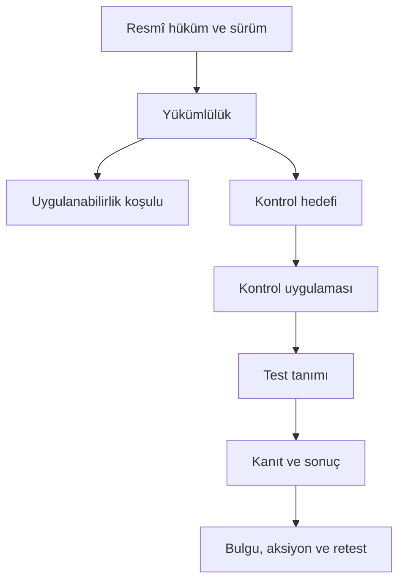

# KALKAN_OS Regülasyon Zekâsı ve Uyum Güvence Modülleri

**Tarih:** 18 Temmuz 2026  
**Durum:** Kurucu ürün ve mimari talimatı  
**Kapsam:** Türkiye ve Avrupa Birliği finansal siber güvenlik, operasyonel dayanıklılık ve KALKAN_OS ürün uyumu

---

## 1. Kurucu kararı

KALKAN_OS yalnız kontrollerin ve kanıtların tutulduğu bir GRC uygulaması olmayacaktır. Sistem:

1. resmî hukuk kaynaklarını sürümlü olarak alacak,
2. mevzuat değişikliklerini tespit edecek,
3. hukuk metnini uygulanabilir yükümlülüklere bağlayacak,
4. kurum profiline göre kapsam kararı üretecek,
5. her kontrol testinin hangi hukuk hükmüne dayandığını gösterecek,
6. karar anında geçerli kaynak sürümünü mühürleyecek,
7. kontrol sonucu ve kanıt paketini yasal dayanakla birlikte yeniden doğrulanabilir hale getirecek,
8. hukuk uzmanı onayı bulunmayan çıkarımları bağlayıcı kural olarak çalıştırmayacaktır.

Ürün iddiası şu şekilde sınırlandırılacaktır:

> KALKAN_OS, mevzuata uyumun belirlenmesi, işletilmesi ve kanıtlanması için sürekli güvence altyapısı sağlar. Nihai hukuki yorum, kurumsal uygulama, bağımsız denetim ve düzenleyici otorite kararı yerine geçmez.

“Tam uyum garantisi”, “ceza alınmaz” veya “otomatik hukuk kararı” ifadeleri ürün ve pazarlama dilinde kullanılmayacaktır.

---

## 2. Yeni modül dizisi

Mevcut M16, M17 ve M18 yeniden numaralandırılmayacaktır. Yeni modüller M19’dan başlayacaktır.

| Modül | Ad | Ana sonuç |
|---|---|---|
| M19 | Regulatory Source Fabric | Resmî kaynakların güvenilir ve sürümlü alınması |
| M20 | Temporal Legal Corpus | Madde/fıkra düzeyinde iki zamanlı hukuk veri tabanı |
| M21 | Obligation & Control Knowledge Graph | Hüküm-yükümlülük-risk-kontrol-test-kanıt ilişkisi |
| M22 | Jurisdiction & Applicability Engine | Kuruma ve tarihe göre açıklanabilir kapsam kararı |
| M23 | Legal-Basis Execution Guard | Hukuk dayanağı doğrulanmadan kontrolün zorunlu çalışmaması |
| M24 | Regulatory Evidence & Citation Service | Her sonucun hüküm ve kaynak nüshasıyla kanıtlanması |
| M25 | Regulatory Change & Impact Radar | Değişiklik, etki, yeniden değerlendirme ve bildirim |
| M26 | Türkiye 7545 & Critical Infrastructure Pack | Siber Güvenlik Başkanlığı ve kritik altyapı güvence paketi |
| M27 | Türkiye Financial Regulators Pack | SPK, BDDK, TCMB, KVKK ve ilgili finansal düzenleyiciler |
| M28 | EU DORA Production Pack | DORA, RTS/ITS, Register of Information ve raporlama |
| M29 | EU CRA Product Compliance Pack | KALKAN_OS’un kendi CRA üretici uyumu |
| M30 | EU AI Act Assurance Pack | AI rolü, risk sınıfı, insan gözetimi ve teknik kanıt |
| M31 | KVHS & AML Boundary Pack | SPK kripto kontrolleri ve MASAK entegrasyon sınırı |
| M32 | Regulatory Reporting Gateway | Yetkili otoriteye kontrollü dışa aktarım ve teslim kanıtı |
| M33 | KALKAN_OS Product Compliance Center | Ürünün kendi 7545, CRA, güvenli geliştirme ve sertifikasyonu |

M19-M25 ortak çekirdektir. M26-M33, ortak çekirdeğin üzerine kurulan doğrulanmış içerik ve iş akışı paketleridir.

---

## 3. M19 — Regulatory Source Fabric

### Amaç

Resmî hukuk ve düzenleyici kaynakları güvenilir biçimde almak, orijinal nüshayı korumak ve hangi verinin nereden geldiğini ispatlamak.

### Kaynak sınıfları

| Seviye | Kaynak | Ürün davranışı |
|---|---|---|
| A | Resmî ve makinece okunabilir API/XML/RDF | Otomatik alınabilir, bütünlük kontrolünden sonra işlenir |
| B | Resmî HTML/PDF/duyuru | Otomatik veya yarı otomatik alınır; belge hash’i ve görsel doğrulama gerekir |
| C | Resmî olmayan rehber, hukuk bürosu yorumu, akademik kaynak | Araştırma olarak tutulur; bağlayıcı kural üretemez |
| D | AI çıkarımı veya kullanıcı notu | Taslak olarak tutulur; hukuk onayı olmadan çalışamaz |

### AB connector’ları

- EUR-Lex Webservice: kayıtlı kullanıcılar için SOAP/XML sorguları
- CELLAR API ve Data Dump: yüksek hacimli resmî veri alımı
- CELEX kimliği: hukuk belgesinin değişmez kimliği
- ELI URI ve metadata: hukuk kaynağı ve sürüm ilişkileri
- Official Journal nüshası
- Konsolide metin ve değişiklik ilişkileri
- Komisyon/ESA teknik standartları ve resmî Q&A kaynakları

EUR-Lex içeriği ücretsiz yeniden kullanılabilir; buna rağmen kaynak gösterme, telif koşulları ve değişiklik yapıldıysa bunun açıklanması zorunlu ürün gereksinimi olarak tutulacaktır.

### Türkiye connector’ları

- T.C. Resmî Gazete arşivi
- Cumhurbaşkanlığı/Adalet Bakanlığı Mevzuat Bilgi Sistemi
- SPK Mevzuat Sistemi, bültenler ve kurul duyuruları
- BDDK mevzuat, kurul kararları ve duyuruları
- TCMB ödeme/e-para düzenlemeleri
- MASAK mevzuat ve genel tebliğleri
- KVKK kararları ve rehberleri
- Siber Güvenlik Başkanlığı mevzuat, rehber ve kritik altyapı duyuruları
- TSE/uluslararası standardın lisanslı metadata’sı; standart tam metni lisanssız kopyalanmaz

Türkiye tarafında kararlı ve kapsamlı bir açık API varsayılmayacaktır. Kaynak başına kullanım koşulu ve erişim yöntemi kaydedilecek; izinsiz scraping tek doğruluk kaynağı yapılmayacaktır. Gerekli durumda resmî veri erişim sözleşmesi veya lisans alınacaktır.

### Veri modeli

```text
RegulatorySource
SourceAccessPolicy
IngestionConnector
IngestionRun
SourceArtifact
ArtifactSignature
ArtifactVerification
RetrievalFailure
```

`SourceArtifact` asgari alanları:

```text
id, jurisdiction, authority, sourceTier
canonicalUri, externalIdentifier
retrievedAt, publishedAt
mimeType, language
rawFileHash, transportMetadataHash
httpEtag, lastModified
signatureStatus, certificateChain
licenceAndReuseTerms
storageObjectVersion
supersedesArtifactId
```

### Güvenlik kararları

- İndirilen HTML/PDF/XML güvenilmeyen girdi kabul edilir.
- Parser işlemleri izole runner’da yapılır.
- XML external entity, zip bomb, PDF script, path traversal ve parser DoS kontrolleri uygulanır.
- Orijinal dosya immutable object storage’da tutulur.
- Parser çıktısı orijinal dosyanın yerine geçmez.
- Kaynak silinse bile alınmış resmî nüsha ve hash geçmişi korunur.
- Kaynağın HTTP 200 dönmesi hukuki doğrulama sayılmaz.

### Kabul kriterleri

- Aynı resmî nüsha tekrar alındığında duplicate üretmemesi
- Değişen içerik aynı URL’de yayımlanırsa yeni artifact sürümü oluşması
- Kaynak, zaman ve hash olmadan hiçbir belge `INGESTED_VERIFIED` olamaması
- Üçüncü taraf yorumu ile resmî kaynağın açıkça ayrılması
- Connector hatasının eski yürürlük bilgisini sessizce güncelmiş gibi göstermemesi

---

## 4. M20 — Temporal Legal Corpus

### Amaç

Hukuk metnini belge düzeyinde değil; madde, fıkra, bent ve geçici hüküm düzeyinde, geçmişe dönük olarak yeniden üretilebilir biçimde saklamak.

### İki zamanlı model

Her hukuki nesnede iki ayrı zaman tutulacaktır:

- `valid_time`: hükmün hukuken geçerli olduğu dönem
- `system_time`: KALKAN_OS’un hükmü ne zaman bildiği/kaydettiği

Bu ayrım şu soruya cevap verir:

> 15 Mart 2027’de yapılan bir kontrol için, o tarihte yürürlükte olan ve KALKAN_OS’un karar anında bildiği hüküm neydi?

### Veri modeli

```text
LegalInstrument
LegalInstrumentVersion
LegalProvision
ProvisionVersion
ProvisionRelation
EffectiveDateRule
TransitionRule
ConsolidationRecord
OfficialCitation
```

`ProvisionRelation` türleri:

```text
AMENDS, REPEALS, REPLACES, CORRECTS
IMPLEMENTS, DELEGATES_TO, DEROGATES
LEX_SPECIALIS_OF, REFERENCES
HAS_RTS, HAS_ITS, HAS_GUIDANCE
```

### Kritik kurallar

- Konsolide metin tek başına geçmiş hükmün kanıtı değildir; değişiklik işlemleri de saklanır.
- Düzeltme/tekzip yeni sürüm üretir.
- Yürürlük tarihi ile yayım tarihi birbirine karıştırılmaz.
- Kademeli uygulama tarihleri hüküm bazında tutulur.
- AB düzenlemelerinde `entry_into_force`, `applies_from` ve istisnai madde tarihleri ayrılır.
- Türkiye’de geçiş ve ikincil düzenleme şartları bağımsız nesne olur.

### Kabul kriterleri

- Herhangi bir tarih için madde/fıkra sürümünün yeniden üretilebilmesi
- Değişen hükmün bağlı kontrollerinin tespit edilebilmesi
- Kaynağı olmayan parse edilmiş hükmün `VERIFIED_TEXT` olamaması
- Konsolide ve orijinal Official Journal/Resmî Gazete nüshasının birlikte gösterilmesi

---

## 5. M21 — Obligation & Control Knowledge Graph

### Amaç

Hukuk metni ile ürün davranışı arasındaki izlenebilir zinciri kurmak.



### Veri modeli

```text
Obligation
ObligationVersion
ObligationProvisionLink
ApplicabilityPredicate
ControlObjective
SharedControl
ControlImplementation
ControlTestDefinition
EvidenceRequirement
ReportingRequirement
PenaltyReference
LegalInterpretation
MappingApproval
```

### Yükümlülük alanları

```text
obligationType
actorRole
requiredAction
protectedObject
frequencyOrTrigger
deadlineRule
recipientAuthority
mandatoryOrGuidance
proportionalityRule
exceptionRule
effectivePeriod
legalConfidence
verificationStatus
```

### Doğrulama statüleri

```text
DRAFT_RESEARCH
TODO_DOGRULA
LEGAL_REVIEW
VERIFIED
SUPERSEDED
REJECTED
```

Yalnız `VERIFIED` ve yürürlükte olan yükümlülük müşteri için zorunlu sonuç üretebilir.

### AI sınırı

AI şunları yapabilir:

- madde bölümleme önerisi,
- değişiklik özeti,
- olası yükümlülük çıkarımı,
- kontrol eşleştirme önerisi,
- çeviri/özet.

AI şunları yapamaz:

- yükümlülüğü `VERIFIED` yapmak,
- hukuki kapsamı nihai belirlemek,
- uyum sonucu vermek,
- ceza riskini kesin olarak belirlemek,
- resmî metni sessizce değiştirmek.

### Dört göz ilkesi

Bağlayıcı mapping için en az:

1. düzenleyici alan uzmanı/hukukçu hazırlığı,
2. farklı bir yetkili tarafından onay,
3. kaynak hash’i ve hüküm sürümü,
4. gerekçe ve değişiklik notu

zorunludur.

---

## 6. M22 — Jurisdiction & Applicability Engine

### Amaç

Kurumun hangi düzenlemeye neden tabi olduğunu, hangi tarihten itibaren ve hangi istisnalarla açıklamak.

### Kurum profili

```text
LegalEntity
Licence
RegulatoryStatus
JurisdictionPresence
ServiceOffering
CustomerType
GroupRelationship
SizeMetric
CriticalInfrastructureStatus
ProductManufacturerRole
AIActRole
CryptoAssetRole
ICTThirdPartyRole
```

### Örnek kapsam girdileri

- Türkiye/AB’de kuruluş veya hizmet sunma
- Banka, aracı kurum, ödeme/e-para, portföy yönetimi, sigorta, KVHS statüsü
- AB’de finansal kuruluş türü
- Dijital unsurlu ürün üreticisi/ithalatçısı/dağıtıcısı olma
- AI provider/deployer/importer/distributor rolü
- Kritik altyapı işletmecisi veya kritik hizmet sağlayıcısı olma
- Grup ve konsolidasyon seviyesi
- Mikro işletme veya orantılılık kriterleri
- Dış hizmet ve bulut kullanımı

### Karar çıktısı

Her kapsam kararı şu paketi üretir:

```text
Applicable / Not Applicable / Conditional / Unknown
tenantProfileSnapshotHash
matchedRuleVersion
legalProvisionVersionIds
effectiveDate
reasoningTrace
exceptionOrDerogation
manualOverride
approver
decisionTimestamp
```

### Güvenlik kuralları

- `Unknown`, otomatik olarak `Not Applicable` sayılamaz.
- Manuel override süreli, gerekçeli ve bağımsız onaylı olur.
- Kapsam girdisi değişince eski karar sessizce güncellenmez; yeniden değerlendirme açılır.
- Araştırma statüsündeki kural zorunluluk üretmez.

---

## 7. M23 — Legal-Basis Execution Guard

### Amaç

KALKAN_OS’un yaptığı otomatik işin geçerli ve doğrulanmış bir hukuk/kontrol dayanağı bulunup bulunmadığını çalışma anında kontrol etmek.

### Çalıştırma öncesi guard

Her zorunlu kontrol testi, bildirim saati veya regülasyon işi çalışmadan önce:

1. tenant kapsam kararı geçerli mi,
2. yükümlülük `VERIFIED` mı,
3. hüküm çalışma tarihinde yürürlükte mi,
4. mapping ve kontrol sürümü yayımlanmış mı,
5. gerekli hukuk onayı var mı,
6. kaynak artifact bütünlüğü doğrulanıyor mu,
7. kural yürürlükten kalkmış veya askıya alınmış mı

kontrol edilir.

### Çıktı

```text
ALLOW_MANDATORY
ALLOW_GUIDANCE_ONLY
BLOCK_UNVERIFIED
BLOCK_SUPERSEDED
REQUIRE_REVIEW
```

### Execution Legal Snapshot

Her çalıştırmada immutable snapshot oluşturulur:

```text
executionId
tenantProfileSnapshotHash
applicabilityDecisionId
obligationVersionId
provisionVersionIds
sourceArtifactHashes
controlVersionId
testDefinitionVersionId
legalMappingApprovalId
executedAt
```

Bu snapshot bulunmadan sonuç “mevzuat uyum testi” olarak etiketlenemez.

---

## 8. M24 — Regulatory Evidence & Citation Service

### Amaç

Denetçi veya düzenleyici, KALKAN_OS’un sonucundan doğrudan dayandığı resmî hükme ve o tarihte kullanılan sürüme gidebilsin.

### Citation paketi

- Kurum/otorite
- Düzenleme adı ve numarası
- CELEX/ELI veya Türkiye resmî kimliği
- Resmî Gazete/Official Journal tarih ve sayısı
- Madde/fıkra/bent
- Hüküm sürümü ve geçerlilik tarihi
- Resmî URI
- Kaynak artifact hash’i
- İlgili fragment hash’i
- Alınma zamanı
- Konsolide metin uyarısı
- Mapping onayı

### Kanıt manifestiyle bağlantı

Mevcut dört hash kararı korunur:

- `reportDataHash`
- `coreManifestHash`
- `pdfFileHash`
- `packageManifestHash`

Regülasyon ekinde ayrıca:

```text
legalSnapshotHash
sourceBundleHash
applicabilityDecisionHash
```

bulunur. PDF kendi hash’ini içermez; deterministik rapor verisi ve manifest zinciri esas alınır.

### Doğrulama ekranı

Denetçi şu zinciri tek ekranda görür:

```text
Hüküm → yükümlülük → kapsam kararı → kontrol → test → kanıt → bulgu → retest
```

---

## 9. M25 — Regulatory Change & Impact Radar

### Amaç

Yeni veya değişen düzenlemenin hangi müşteri, kontrol, sözleşme, rapor ve kanıtı etkilediğini bulmak.

### Akış

```text
Yeni resmî artifact
→ hash/diff
→ hüküm değişikliği
→ hukuk inceleme kuyruğu
→ yükümlülük/mapping etkisi
→ müşteri kapsam etkisi
→ kontrol yeniden değerlendirme
→ bildirim ve aksiyon
```

### Değişiklik sınıfları

```text
NEW, AMENDED, REPEALED, CORRECTED
EFFECTIVE_DATE_CHANGED
GUIDANCE_CHANGED
REPORTING_TEMPLATE_CHANGED
PENALTY_CHANGED
SCOPE_CHANGED
```

### Güvenlik davranışı

- AI fark özeti hazırlayabilir; hukuki etkiyi onaylayamaz.
- Kaynak erişilemezse “değişiklik yok” denmez; `SOURCE_STALE` alarmı üretilir.
- Kritik kaynağın son başarılı senkronizasyon yaşı dashboard’da gösterilir.
- Geriye etkili düzeltme varsa geçmiş değerlendirmeler yeniden incelemeye açılır, geçmiş kayıt silinmez.

---

## 10. M26 — Türkiye 7545 & Critical Infrastructure Pack

### İçerik

- 7545 sayılı Kanun madde/yükümlülük haritası
- Siber Güvenlik Başkanlığı ikincil düzenleme ve duyuru takibi
- Kritik sektör → işletmeci → hizmet → sistem → varlık hiyerarşisi
- Varlık/veri envanteri ve risk analizi
- SOME kuruluş, rol, olgunluk ve tatbikat yönetimi
- Zafiyet ve siber olay için gecikmeksizin bildirim saati
- Başkanlık bilgi/belge talepleri için response room
- Yetkili/belgeli ürün ve hizmet sağlayıcı kontrolü
- Yerli ürün tercihi karar kaydı
- Denetim erişimi ve delil paketi
- Yaptırım referansları; otomatik ceza kararı değil

### Açık bağımlılık

Başkanlığın yayımlayacağı ikincil düzenlemeler ve teknik formatlar çıkmadan ilgili kontroller `CONDITIONAL` veya `TODO_DOGRULA` tutulacaktır.

---

## 11. M27 — Türkiye Financial Regulators Pack

### Alt paketler

1. **SPK BSYUE/BSBD:** kurum profili, bilgi sistemi yönetimi ve bağımsız denetim
2. **BDDK:** bilgi sistemleri, elektronik bankacılık, dış hizmet, bulut ve bağımsız denetim
3. **TCMB:** ödeme/e-para kuruluşları bilgi sistemleri ve operasyonel süreçleri
4. **KVKK:** veri işleme, güvenlik, ihlal ve saklama bağlantıları
5. **Kurumlar arası ortak kontrol haritası:** tek kanıtla birden fazla yükümlülüğün karşılanması

### Özellikler

- Resmî madde bazlı doğrulanmış kontrol katalogları
- Kurum türü ve lisansa göre kapsam
- Periyodik ve olay tetiklemeli yükümlülük takvimi
- Denetim örnekleme M17 entegrasyonu
- Eğitim/yetkinlik M18 entegrasyonu
- SoD M16 entegrasyonu
- Otoriteye özgü rapor dışa aktarımları

---

## 12. M28 — EU DORA Production Pack

### İçerik

- DORA ana düzenleme ile yürürlükteki RTS/ITS bağlantıları
- Finansal kuruluş türü ve orantılılık kapsamı
- ICT risk management framework
- Yönetim organı karar/eğitim kayıtları
- Kritik/önemli fonksiyon ve etki toleransı
- ICT varlık ve bağımlılık grafiği
- Major ICT incident sınıflandırma ve raporlama
- Operasyonel dayanıklılık test programı
- TLPT workspace
- ICT third-party risk, sözleşme maddeleri ve exit planı
- Resmî `Register of Information` veri şeması ve export
- Yıllık/olay bazlı yeniden değerlendirme

### Kapsam sınırı

KALKAN_OS uyum yönetimi ve kanıtı sağlar; kurumun güvenlik araçlarını, kriz ekibini veya nihai yetkili otorite teslim sorumluluğunu ortadan kaldırmaz.

---

## 13. M29 — EU CRA Product Compliance Pack

Bu modül müşteriden önce KALKAN_OS’un kendi ürün uyumunu hedefler.

### İçerik

- Üretici/ithalatçı/dağıtıcı rolü
- Ürün sınıflandırması ve kapsam
- Secure-by-design/default gereksinimleri
- Ürün siber risk değerlendirmesi
- SBOM ve bileşen/provenance
- Coordinated Vulnerability Disclosure
- Zafiyet alım, triage, remediation ve disclosure SLA’ları
- Güvenlik güncellemesi ve destek dönemi
- Aktif istismar edilen zafiyet/ciddi olay bildirim saati
- Teknik ürün dosyası
- Uygunluk değerlendirmesi ve AB uygunluk beyanı
- CE işaretleme hazırlığı
- Her sürüm için CRA evidence package

### Release guard

CRA kapsamındaki AB üretim sürümü:

- SBOM,
- risk değerlendirmesi,
- açık kritik zafiyet kararı,
- güvenli güncelleme kanıtı,
- teknik dosya sürümü

olmadan yayımlanamaz.

---

## 14. M30 — EU AI Act Assurance Pack

### İçerik

- AI sistemi/model/agent envanteri
- Provider, deployer, importer, distributor rolü
- Kullanım amacı ve önemli değişiklik yönetimi
- Yasak uygulama kontrolü
- Yüksek risk sınıflandırması
- Veri yönetişimi ve kalite
- Teknik dokümantasyon
- Log ve kayıt tutma
- İnsan gözetimi
- Doğruluk, dayanıklılık ve siber güvenlik
- Şeffaflık ve kullanıcı bildirimi
- AI okuryazarlığı/eğitim kanıtı
- Model/prompt/agent sürüm ve tedarikçi riski

KALKAN_OS AI’sı uyum sonucu, kontrol skoru veya hukuk statüsü belirleyemez. Üretilen öneri kabul/reddet iş akışına ve insan onayına tabi olur.

---

## 15. M31 — KVHS & AML Boundary Pack

### SPK/KVHS kapsamı

- III-35/B.1 ve III-35/B.2 doğrulanmış yükümlülük haritası
- Organizasyon, iç kontrol, risk ve bilgi sistemleri
- Saklama/cüzdan/anahtar kontrol güvence testleri
- Müşteri varlığı ve kurum kayıtları mutabakatı
- Rezerv kanıtı çalışma alanı
- Transfer ve listeleme kontrol kanıtları
- Bağımsız denetim odası

### MASAK sınırı

KALKAN_OS varsayılan olarak tam AML işlem izleme motoru olmayacaktır. Şunları yönetir:

- AML kontrol yükümlülükleri,
- prosedür ve eğitim kanıtı,
- entegrasyon/izleme aracının çalışma kanıtı,
- şüpheli işlem iş akışı metadata’sı,
- erişim kontrollü rapor teslim kanıtı.

Ham müşteri işlem gözetimi ve yaptırım taraması ayrı lisanslı connector/ürün ile yapılır. Çok hassas AML verisi, varsayılan kanıt deposuna kopyalanmaz.

---

## 16. M32 — Regulatory Reporting Gateway

### Amaç

Otoriteye gönderilecek raporu doğru şablon, süre, yetki ve kanıt zinciriyle hazırlamak.

### Özellikler

- Otorite ve rapor türü şablonları
- Olaydan türeyen deadline clock
- Maker-checker ve hukuk/uyum onayı
- Ön izleme, doğrulama ve zorunlu alan kontrolü
- Hassas veri redaksiyonu
- Export/API/KEP/portal teslim yöntemi metadata’sı
- Teslim makbuzu ve acknowledgment
- Düzeltme/yeniden gönderim sürümü
- Gönderilen paket hash’i

### Güvenlik kararı

İlk sürüm otomatik dış gönderim yapmayacaktır. Sistem paketi hazırlar; yetkili kişi açık onay verir. Otorite API’si, kimlik doğrulama ve hukuki yetki doğrulanmadan otomatik gönderim açılmaz.

---

## 17. M33 — KALKAN_OS Product Compliance Center

### Amaç

KALKAN_OS’un müşteriye sattığı uyum iddiasını kendi ürün ve şirket süreçlerinde de kanıtlamak.

### İçerik

- 7545 siber güvenlik şirketi yetkilendirme/sertifikasyon takibi
- CRA üretici uyumu
- ISO 27001/SOC 2 gibi güvence haritaları
- Secure SDLC
- Threat model ve güvenlik mimarisi
- SBOM/provenance ve release attestation
- Vulnerability disclosure ve PSIRT
- Anahtar/KMS/HSM yönetişimi
- JWS ve RFC 3161 hizmet kararları
- Veri yerleşimi, alt işleyenler ve DPA
- Penetrasyon testi ve bağımsız denetim
- Trust Center için doğrulanmış belge yayını

Bu merkez olmadan KALKAN_OS’un “regülasyon kanıt platformu” iddiası kurumsal satışta eksik kalır.

---

## 18. Ortak teknik mimari

### PostgreSQL

Yeni tablolar ayrı `regulatory` şemasında tutulabilir. Tenant’a özgü kararlar RLS kapsamındadır; global resmî corpus salt-okunur ortak veri olabilir. Tenant mapping/override verisi mutlaka tenant izole olmalıdır.

### Object storage

```text
regulatory/raw/{jurisdiction}/{authority}/{year}/{artifactId}
regulatory/parsed/{artifactVersionId}
regulatory/source-bundles/{legalSnapshotId}
```

- Object versioning
- WORM/object lock
- Hash doğrulaması
- Zararlı içerik taraması
- Parser çıktısı ile orijinal ayrımı

### Arama

İlk sürüm PostgreSQL full-text ve `pg_trgm` ile başlayabilir. Semantik arama yalnız keşif içindir; resmî citation her zaman deterministik kimlik ve fragment üzerinden yapılır. Vector sonucu hukuk kanıtı sayılmaz.

### İşler

Mevcut saf PostgreSQL/pg_cron kararıyla uyumlu işler:

```text
regulatory_source_poll
regulatory_artifact_verify
regulatory_parse_pending
regulatory_diff_pending
regulatory_impact_pending
regulatory_staleness_check
applicability_reassessment
```

Her iş idempotent, satır bazlı hata izolasyonlu ve tekrar çalıştırılabilir olmalıdır.

### Gözlemlenebilirlik

- Kaynak başına son başarılı senkronizasyon
- Kaynak staleness yaşı
- Parse/doğrulama hata oranı
- Bekleyen hukuk incelemesi
- Etkilenen tenant/kontrol sayısı
- Superseded kural çalıştırma girişimi
- Eksik source artifact

---

## 19. Değişmez güvenlik ve hukuk invariant’ları

1. Resmî artifact olmadan `VERIFIED` hüküm oluşamaz.
2. Tek kişi mapping hazırlayıp onaylayamaz.
3. AI, hukuk statüsü veya zorunlu uyum kararı veremez.
4. `SUPERSEDED` kural yeni zorunlu test başlatamaz.
5. Geçmiş hukuki karar ve yürütme snapshot’ı değiştirilemez.
6. `Unknown`, `Not Applicable` olarak çevrilemez.
7. Manuel override gerekçesiz, onaysız ve süresiz olamaz.
8. Kaynak erişilemiyorsa sistem güncel olduğunu iddia edemez.
9. Tenant dışı kurum profili veya mapping kullanılamaz.
10. Rapor yalnız güncel metne link vermez; karar anındaki artifact hash’ini içerir.
11. Telif/lisans kısıtlı standart metni izinsiz saklanamaz veya dağıtılamaz.
12. Hukuk metni değişince eski kanıt silinmez; yeniden değerlendirme açılır.

---

## 20. Uygulama fazları

### Faz R0 — ADR ve kaynak hukuku, 2 hafta

- Resmî kaynak envanteri
- Kullanım/lisans koşulları
- Türkiye veri erişim sözleşmesi ihtiyacı
- Bitemporal model ADR
- Legal verification workflow ADR
- Citation ve fragment standardı

### Faz R1 — M19 kaynak çekirdeği, 4 hafta

- EUR-Lex/CELEX pilot connector
- Resmî Gazete manuel güvenli ingestion
- Raw artifact store
- Hash, sürüm ve provenance
- Kaynak staleness dashboard’u

### Faz R2 — M20-M21, 6 hafta

- Madde/fıkra parser’ı
- Bitemporal corpus
- Değişiklik ilişkileri
- Obligation/control graph
- Hukuk onay workflow’u

### Faz R3 — M22-M24, 6 hafta

- Kurum profili ve kapsam motoru
- Legal execution guard
- Execution legal snapshot
- Citation/evidence paketi
- Denetçi doğrulama ekranı

### Faz R4 — M25 ve Türkiye paketleri, 8 hafta

- Regulatory Change Radar
- 7545/kritik altyapı paketi
- SPK/BDDK/TCMB doğrulanmış ilk kontrol paketleri
- Olay/bildirim saatleri

### Faz R5 — AB ve ürün uyumu, 10 hafta

- DORA Production Pack
- CRA Product Compliance
- AI Act Assurance
- KALKAN_OS Product Compliance Center

### Faz R6 — KVHS ve reporting gateway, 6 hafta

- KVHS güvence paketi
- MASAK connector sınırı
- Otorite rapor export’ları
- Acknowledgment ve teslim kanıtı

---

## 21. İlk geliştirme PR’ları

M16 CSV işi bitmeden bu modüllerde uygulama koduna başlanmayacaktır. Sonrasında:

1. **PR-R0:** ADR’ler, source registry ve lisans metadata modeli
2. **PR-R1:** `SourceArtifact`, immutable storage ve manuel ingestion
3. **PR-R2:** EUR-Lex CELEX connector ve idempotent polling
4. **PR-R3:** Provision parser ve bitemporal sürümleme
5. **PR-R4:** Obligation graph ve hukuk onayı
6. **PR-R5:** Applicability engine pilotu
7. **PR-R6:** Legal execution snapshot ve citation bundle
8. **PR-R7:** 7545 pilot pack
9. **PR-R8:** DORA pilot pack

Her PR tüm testleri yeşil tutmalı; kaynak/artifact hash fixture’ları deterministik olmalıdır.

---

## 22. Üretim kabul kapısı

Regülasyon omurgası aşağıdakiler sağlanmadan üretim uyum motoru olarak ilan edilemez:

- En az iki AB ve iki Türkiye resmî kaynak connector’ı
- Resmî artifact, hash ve provenance doğrulaması
- Tarihsel madde sürümünün yeniden üretilebilmesi
- Dört göz hukuk onayı
- Kurum profiline göre açıklanabilir kapsam kararı
- `Unknown` ve `Not Applicable` ayrımı
- Superseded kuralın çalışma anında engellenmesi
- Her kontrol sonucunda execution legal snapshot
- Denetçi için kaynak artifact ve hüküm doğrulaması
- Kaynak staleness alarmı
- Değişiklik sonrası etkilenen kontrollerin bulunması
- Tenant/RLS ve IDOR güvenlik testleri
- Parser saldırı testleri
- AI’ın doğrulama yetkisi olmadığını kanıtlayan authorization testleri
- Telif/lisans kısıtlarının ürün davranışında uygulanması

---

## 23. Başarı ölçütleri

- Doğrulanmış yükümlülüklerin %100’ünde resmî hüküm ve artifact hash’i
- Zorunlu testlerin %100’ünde execution legal snapshot
- Kritik kaynak staleness’ının SLA içinde tespiti
- Mevzuat değişikliğinden etki analizine kadar geçen süre
- Tek kanıtla karşılanan ortak kontrol sayısı
- Denetim sırasında kaynak ve kanıt bulma süresindeki azalma
- Yanlış zorunluluk/yanlış kapsam oranı
- Süresi dolmuş hukuk mapping’i ile çalıştırma sayısı: sıfır

---

## 24. Nihai ürün tanımı

Bu modüller tamamlandığında KALKAN_OS şu yeteneğe ulaşır:

> Türkiye ve AB’nin resmî hukuk kaynaklarını sürümlü olarak izleyen; kurumun kapsamını açıklanabilir biçimde belirleyen; hukuki hükmü kontrol, test ve kanıta bağlayan; yaptığı her uyum değerlendirmesinde karar anındaki hukuk sürümünü mühürleyen; değişiklikleri etki analizine dönüştüren finansal siber güvenlik ve operasyonel dayanıklılık işletim sistemi.

Bu, “tam uyum garantisi” değil; denetlenebilir, kaynaklı ve sürekli güncellenen **uyum güvence altyapısıdır**. Hukuken ve ticari olarak savunulabilir doğru ürün konumu budur.

---

## 25. Resmî kaynak başlangıç listesi

- [EUR-Lex yeniden kullanım koşulları](https://eur-lex.europa.eu/content/help/data-reuse/reuse-contents-eurlex-details.html?locale=en) ve [EUR-Lex Webservice](https://eur-lex.europa.eu/content/help/data-reuse/webservice.html): resmî AB hukuk verisinin XML/webservice ve yüksek hacimde CELLAR/Data Dump üzerinden alınması
- [Regulation (EU) 2022/2554 — DORA](https://eur-lex.europa.eu/eli/reg/2022/2554/oj/eng)
- [Regulation (EU) 2024/2847 — CRA](https://eur-lex.europa.eu/eli/reg/2024/2847/oj/eng)
- [Regulation (EU) 2024/1689 — AI Act](https://eur-lex.europa.eu/eli/reg/2024/1689/oj/eng)
- [7545 sayılı Siber Güvenlik Kanunu — 19 Mart 2025 tarihli Resmî Gazete nüshası](https://www.turmob.org.tr/arsiv/mbs/resmigazete/32846-1.pdf)
- [T.C. Siber Güvenlik Başkanlığı](https://siberguvenlik.gov.tr/)
- [SPK Mevzuat Sistemi](https://mevzuat.spk.gov.tr/Duyurular) ve [KVHS ikincil düzenlemeleri hakkındaki resmî duyuru](https://spk.gov.tr/duyurular/basin-duyurulari/2025/kripto-varlik-hizmet-saglayicilarina-iliskin-iki-teblig-yayimlandi)
- BDDK, TCMB, MASAK ve KVKK resmî mevzuat/karar kaynakları
- [Adalet Bakanlığı Mevzuat sistemi](https://mevzuat.adalet.gov.tr/)

Kaynak listesi connector geliştirilmeden önce veri erişimi, yeniden kullanım, oran limiti, lisans ve arşivleme koşullarıyla birlikte `SourceAccessPolicy` tablosunda onaylanacaktır.
